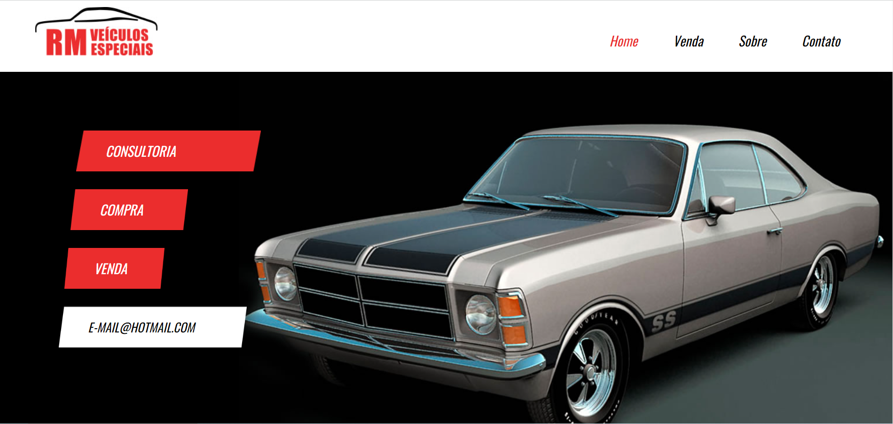
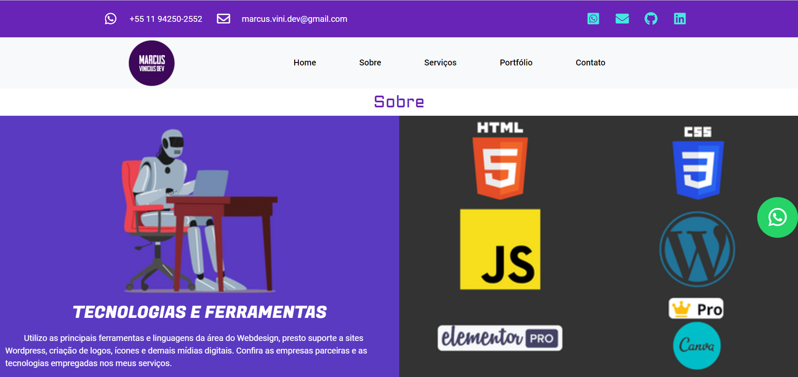

  

<h1 align="center">
  
  Olá! Sou o Marcus Vinicius
  
</h1>

- 🔭 Atualmente trabalho como professor na rede pública de SP
- 🌱 Estudando Java
- 📫 Como me encontrar? **marcus.vini.dev@gmail.com**
- 😄 Pronome ele/dele

  

<h3 align="left">Linguagens e Ferramentas:</h3>   

 
  
  
  <!---->
   
  
   
    
  
  
  

      
  
<h3 align="left">Contatos:</h3>

 
    
  
       

 
  

  
<!--
  

  
&nbsp;

-->
  
  
  
  

  

 
  

<h3 align="center">
  ⬇ Obrigado! Confira meus projetos abaixo e deixe uma ⭐️ ⬇
</h3>

<h1 align="center">Projetos</h1> 
<table>
  <tr>
    <td width="50%" valign="top">
      <h3 align="center">RM Veículos Website</h3>
         
        
         
        
<strong>Website para portfolio</strong>

      

        <strong> Tecnologias utilizadas </strong>
         
        
        
        
      

      

        <strong> IDE usada </strong>
         
          
      

      

          
    
  
      

    </td>
    <td width="50%" valign="top">
      <h3 align="center">Marcus Vinicius Dev Website</h3>
         
        
         
        
<strong>Meu Website</strong>

      

        <strong> Tecnologias utilizadas </strong>
         
        
      

      

        <strong> IDE usada </strong>
         
        
      

      

          
    
  
      

    </td>
  </tr>
</table>
