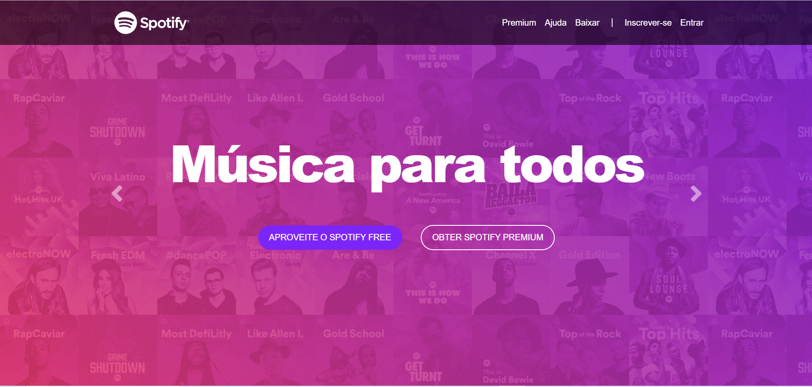
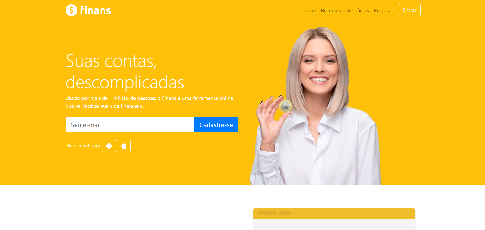
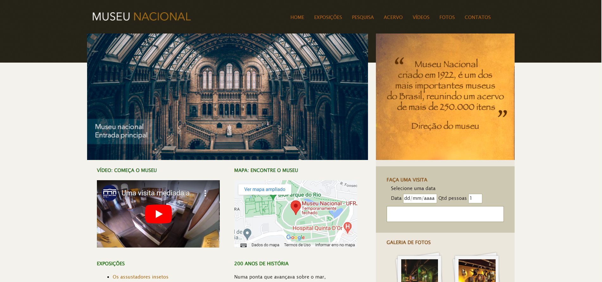
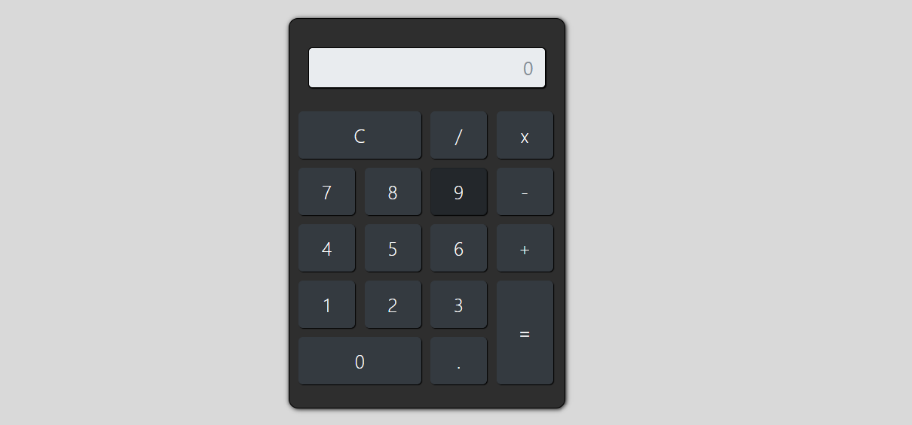
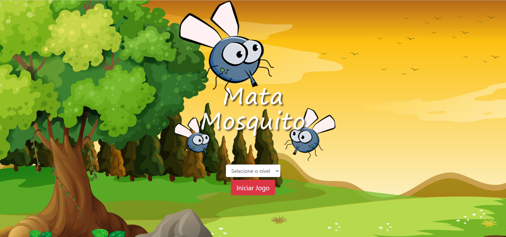

  

<h1 align="center">
  
    Olá! Sou o Marcus Vinicius
  
</h1>

- 🔭 Atualmente trabalho como professor na rede pública de SP
- 🌱 Estudando Java
- 📫 Como me encontrar? **marcus.vini.dev@gmail.com**
- 😄 Pronome ele/dele

 
   

<h3 align="left">Linguagens e Ferramentas:</h3>   

 
  
  
  
   
  
   
    
  
  
  

      
  
<h3 align="left">Contatos:</h3>

 
    
  
       

 

  
  
  

  
  
  <!---->

uses: Platane/snk/svg-only@v2
 
  

<h3 align="center">
  ⬇ Obrigado! Confira meus projetos abaixo e deixe uma ⭐️ ⬇
</h3>

<h1 align="center">Projetos
</h1> 
<table>
<tr>
  <td width="50%" valign="top">
    <h3 align="center">Marcus Vinicius Dev</h3>
       
      
       
      
<strong>Meu Website</strong>

      

        <strong> Tecnologias utilizadas </strong>
         
        
      

      

        <strong> IDE usada </strong>
         
        
      

      

          
        
      

    </td>
    <td width="50%" valign="top">
      <h3 align="center">RM Veículos</h3>
       
      
       
      
<strong>Compra e venda de carros</strong>

      

        <strong> Tecnologias utilizadas </strong>
         
          
          
      

      

        <strong> IDE usada </strong>
         
        
      

      
        
           
          
      

    </td>
</tr>
<tr>
  <td width="50%" valign="top">
    <h3 align="center">Spotify clone (layout de estudo)</h3>
     
    
     
    

      <strong>Website para portfolio</strong>
    

    

      <strong> Tecnologias utilizadas </strong>
     
          
          
           
    </a>
  

  

    <strong> IDE usada </strong>
     
    
  

  

        
      
    

  </td>
  <td width="50%" valign="top">
    <h3 align="center">Finans</h3>
     
    
     
    

      <strong>Site de Finanças</strong>
    

    

      <strong> Tecnologias utilizadas </strong>
       
          
          
          
    

    

      <strong> IDE usada </strong>
       
      
    

    

        
      
    

  </td>
</tr>
<tr>
  <td width="50%" valign="top">
    <h3 align="center">Museu Nacional</h3>
       
      
       
      

        <strong>Site do Museu</strong>
      

      

        <strong> Tecnologias utilizadas </strong>
         
          
          
      

      

        <strong> IDE usada </strong>
         
        
      

      

          
        
      

    </td>
    <td width="50%" valign="top">
      <h3 align="center">App Calculadora</h3>
       
      
       
      

        <strong>Aplicativo de calculadora simples</strong>
      

      

        <strong> Tecnologias utilizadas </strong>
         
          
          
           
      

      

        <strong> IDE usada </strong>
         
        
      

      

          
        
      

    </td>
  </tr>
  <tr>
  <td width="50%" valign="top">
    <h3 align="center">Jogo do Mosquito</h3>
       
      
       
      

        <strong>App de Game</strong>
      

      

        <strong> Tecnologias utilizadas </strong>
         
          
          
           
      

      

        <strong> IDE usada </strong>
         
        
      

      

          
        
      

    </td>
<!--<td width="50%" valign="top">
      <h3 align="center">App Calculadora</h3>
       
      
       
      

        <strong>Aplicativo de calculadora simples</strong>
      

      

        <strong> Tecnologias utilizadas </strong>
         
          
          
          
           
      

      

        <strong> IDE usada </strong>
         
        
      

      

          
        
      

    </td>-->
    <td width="50%" valign="top">
      <h3 align="center">Em breve publicarei algo novo aqui    :gear: :computer:</h3>
       
      

    </td>
  </tr>
</table>
